## Giới thiệu
Đôi khi việc thay đổi quần áo cho nhân vật bạn yêu thích rất phức tạp và tốn thời gian ? Hay chỉ đơn thuần là bạn muốn có thêm trang phục để mặc và nhập vai cùng bạn bè ? Vâng, đây là addon dành cho bạn.

IC Clothes là bản cập nhật cho “Anastasia Clothes” với bổ sung thêm 182 trang phục nâng số lượng trang phục từ 182 lên 364 trang phục, chia làm nhiều phần như: mũ, phụ kiện đeo mặt, đồ bộ, áo, quần.

## Mũ
### Mũ động vật
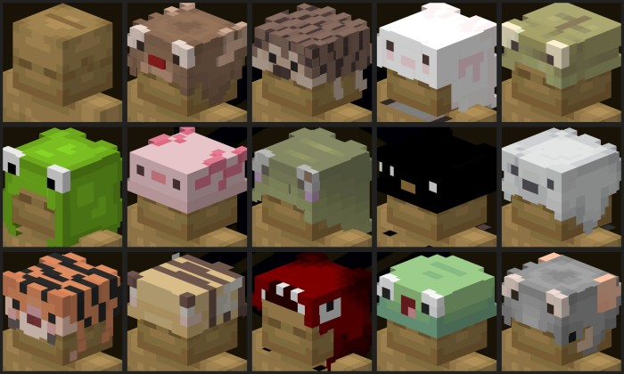

### Mũ len
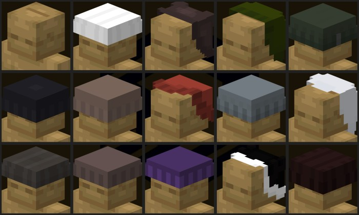

### Mũ dạng xô
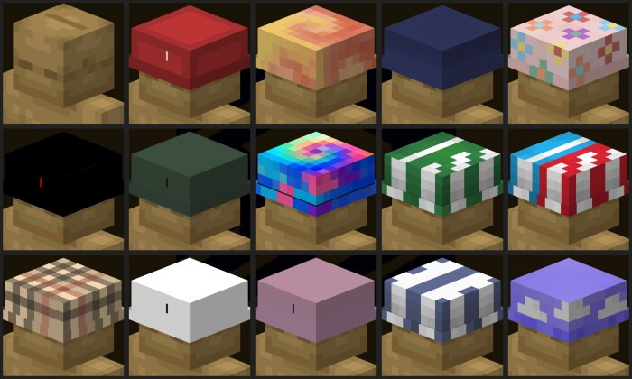

### Mũ lưỡi trai
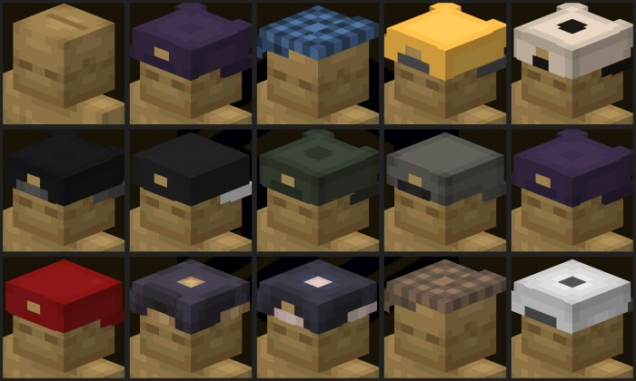

### Fedora
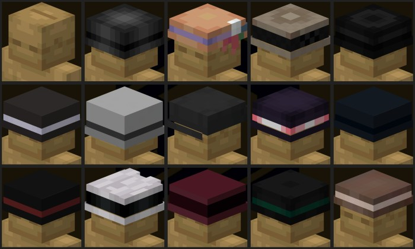

### Mũ bảo hiểm
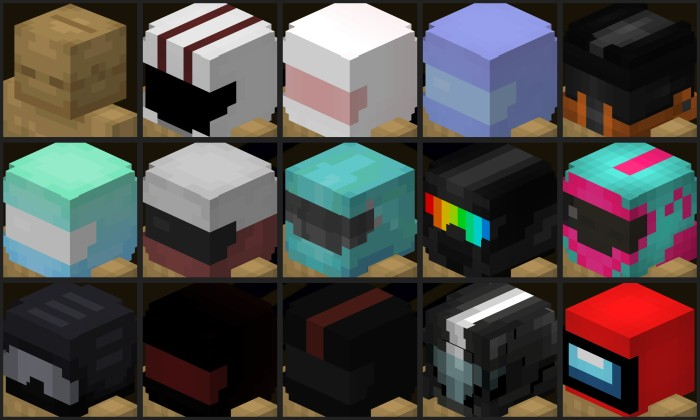

### Mũ khác
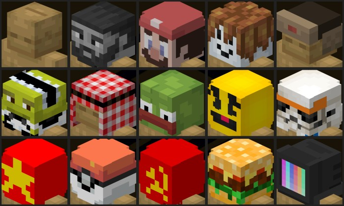

## Phụ kiện mặt
### Mặt nạ động vật
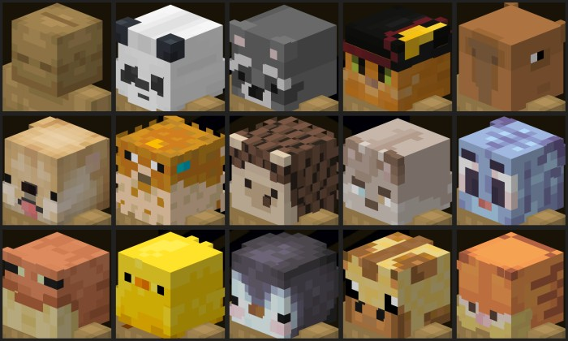

### Emoji
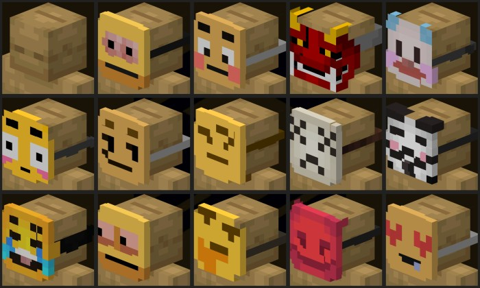

### Mắt kính
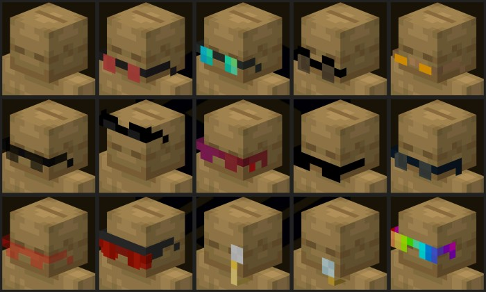

### Mặt nạ
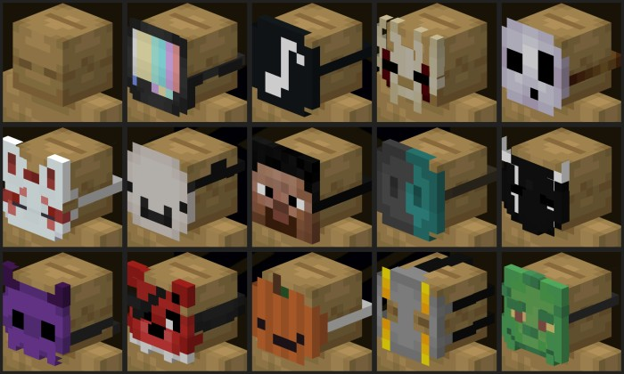

### Mặt nạ trượt tuyết
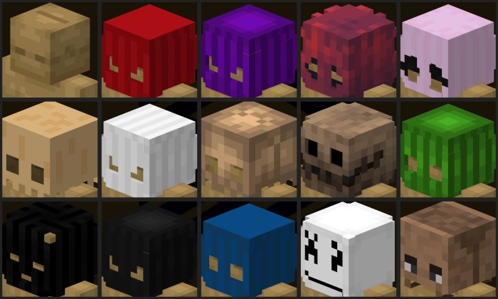

## Trang phục
### Hóa trang
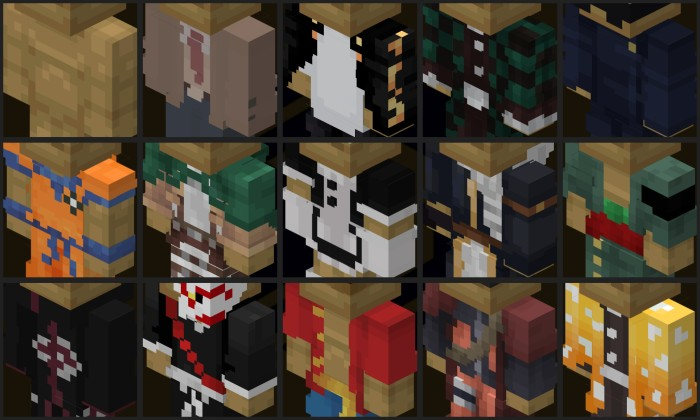

### Đồ bộ một mảnh
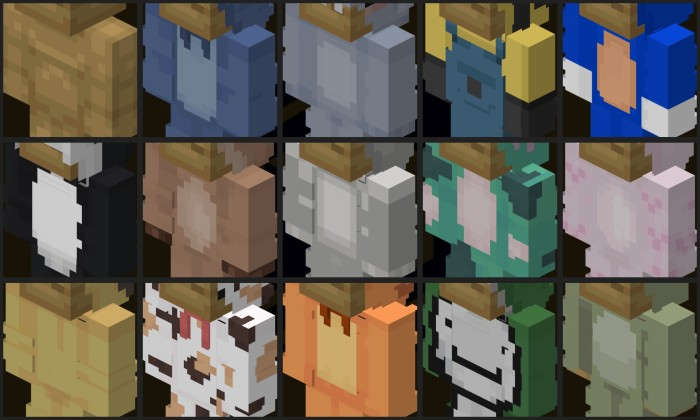

### Bộ vest
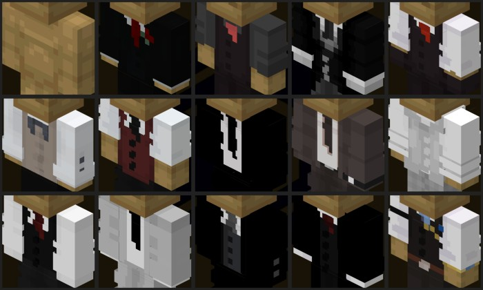

### Đồng phục
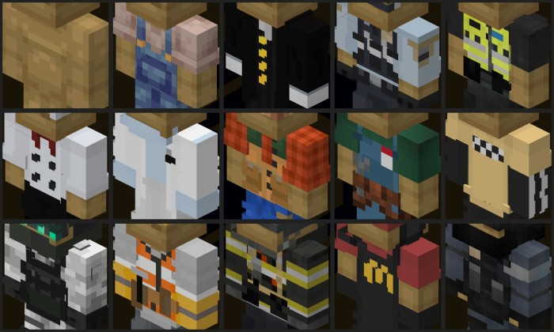

## Áo
### Hoodie
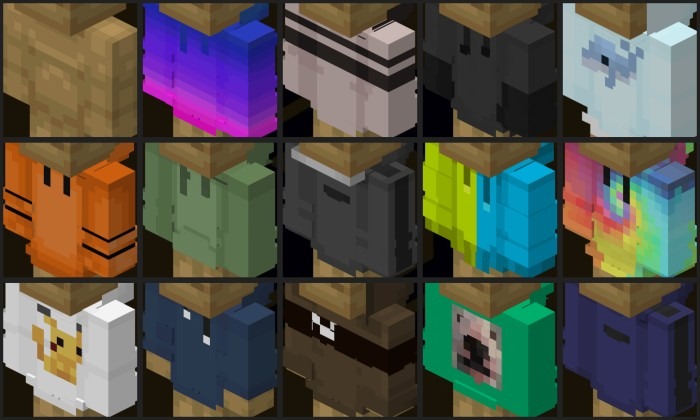

### Áo khoác
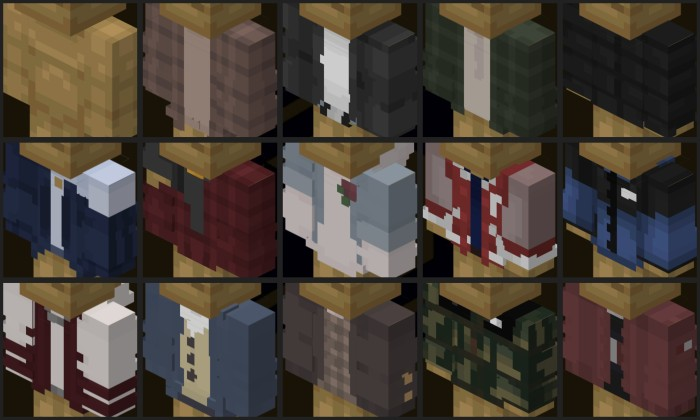

### Áo len
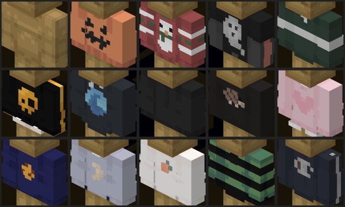

### Cà vạt
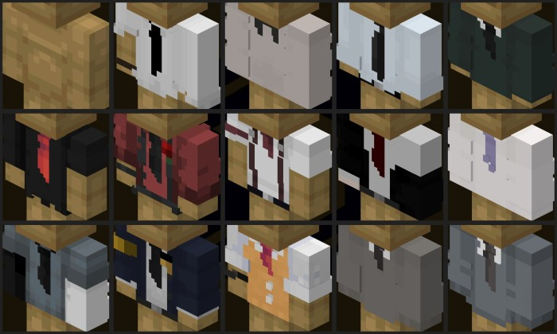

### Áo thun
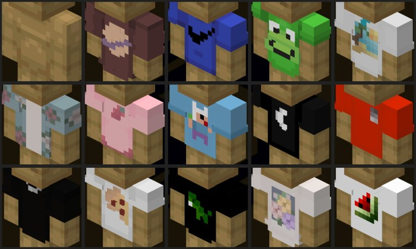

## Quần
### Quần Jean
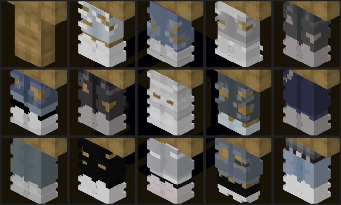

### Quần overall
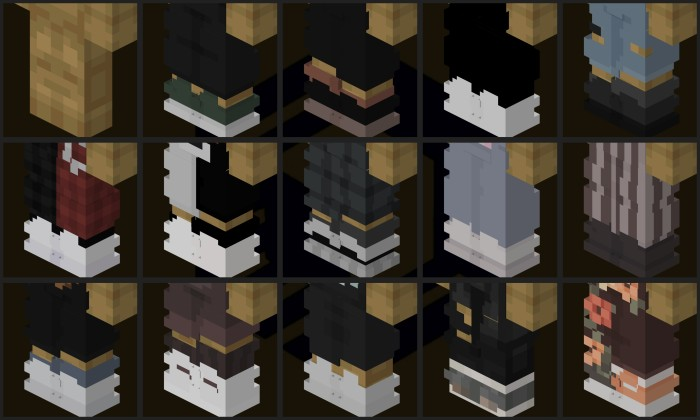

### Quần ngắn
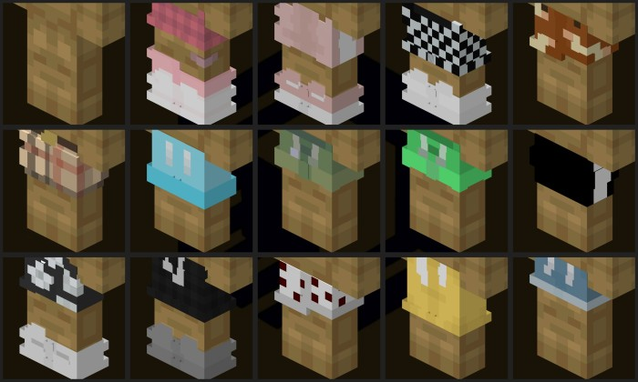

### Quần thể thao
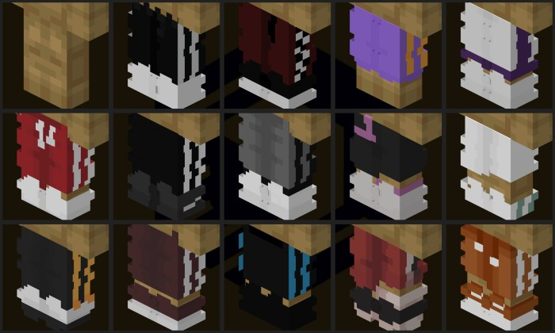

### Quần dài
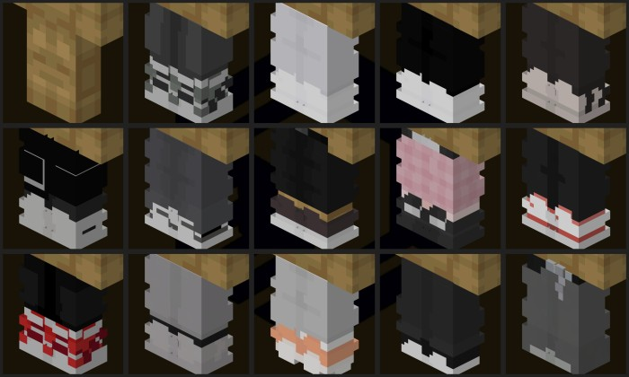

## Drafting Table và Sewing Machine
Ngoài ra chúng tôi còn tạo thêm cho bạn một bàn soạn thảo 16 cuộn chỉ với các màu sắc cơ bản Minecraft và 26 bản thiết kế cho từng loại phụ kiện. Máy may để chế tạo 364 trang phục hoặc dùng để trang trí cho căn nhà của bạn!.
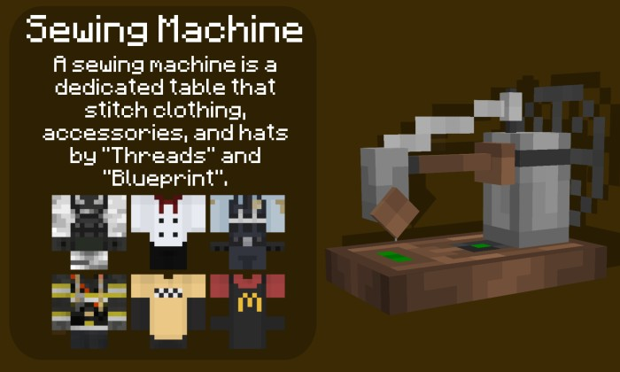
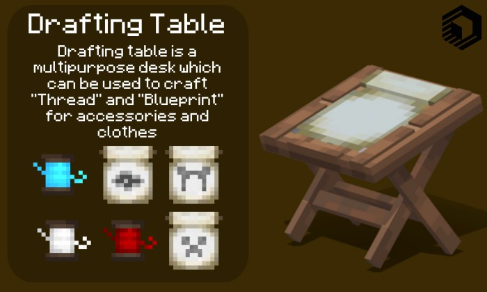

## Tổng kết
Các lỗi phiên bản trước đã được sửa và chúng tôi đã thay thế tất cả mã của addon để nó có thể hoạt động ở phiên bản 1.20.Vui lòng bật đủ thử nghiệm chúng tôi yêu cầu để hoạt động ổn định nhất.
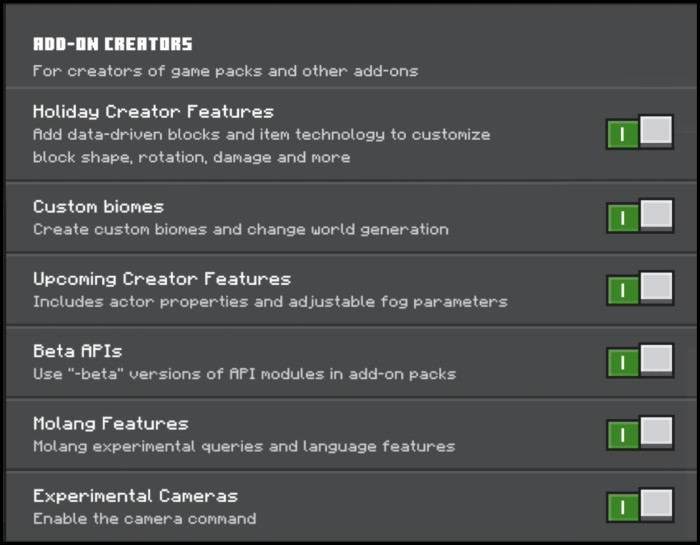

## Download
### Phiên bản hỗ trợ
- PE/Bedrock: 1.19.x - 1.20.x

### Bản Mcpack (Khuyên dùng)
- [IndieCrew_Clothes_BP.mcpack](https://www.mediafire.com/file/qxe7dwn3su1wwbi/IndieCrew_Clothes_BP.mcpack/file)
- [IndieCrew_Clothes_RP.mcpack](https://www.mediafire.com/file/15ggksb4g95asj5/IndieCrew_Clothes_RP.mcpack/file)

### Bản Zip
- [IndieCrew_Clothes_BP.zip](https://www.mediafire.com/file/s7jwcuz7q6g9dys/IndieCrew_Clothes_BP.zip/file)
- [IndieCrew_Clothes_RP.zip](https://www.mediafire.com/file/gk2b33uefux5ede/IndieCrew_Clothes_RP.zip/file)